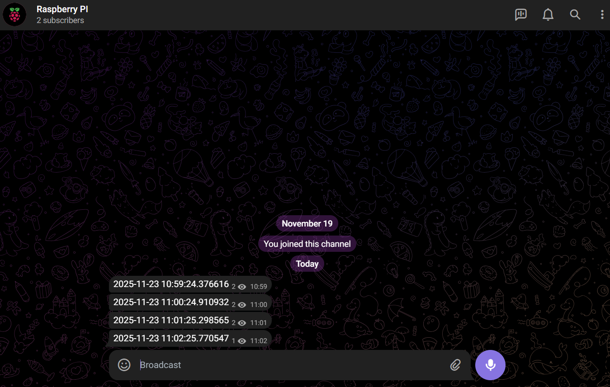

# py_alive_in_telegram

A simple solution to monitor whether your device is operational.
Send an alive message to your Telegram chat or channel every minute.

## Preparing virtual environment 

### Create a virtual environment

```sh
python3 -m venv venv
```

### Activate the virtual environment

#### On Windows

```sh
.\venv\Scripts\activate
```

#### On macOS/Linux

```sh
source venv/bin/activate
```

### Install packages within the activated environment

```sh
pip install -r requirements.txt
```

## Setup

- Copy `.env.example` to `.env`;
    ```sh
    cp .env.example .env
    ```

- Replace the `TOKEN` value to your bot token, you can get it following the [Telegram Documentaion](https://core.telegram.org/bots/features#creating-a-new-bot);

- Replace the `CHAT_ID` value with the unique identifier for the target chat or username of the target channel (in the format `@channelusername`).

## Usage

```sh
python3 .\send_to_telegram.py
```

## Results

